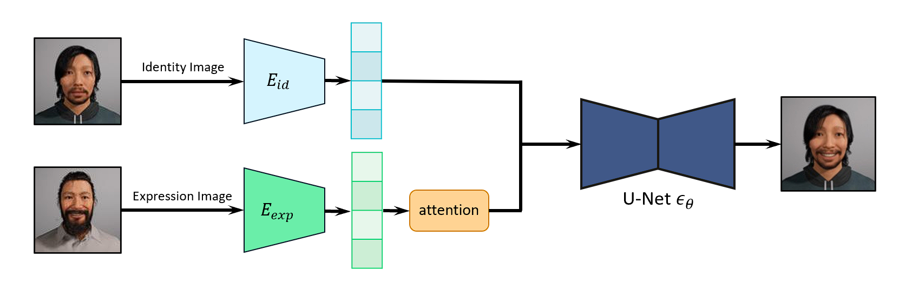

# XIDiff: Using deep generative models to generate characters with different emotions

XIDiff = Expression + Identity + Diffusion

### Diagram of model



This project is inspired by  [DCFace](https://github.com/mk-minchul/dcface).

### Installation
* Python 3.9
* Linux
* NVIDIA GPU + CUDA CuDNN
* Pytorch (>=1.5)

We recommend running this repository using [Anaconda](https://docs.anaconda.com/anaconda/install/).  

```
conda env create -f environment.yml
```